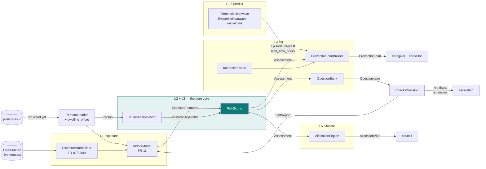
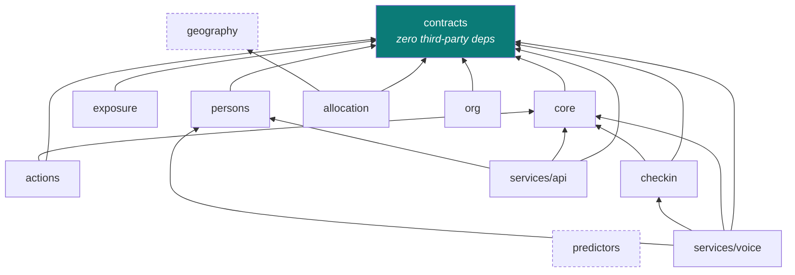
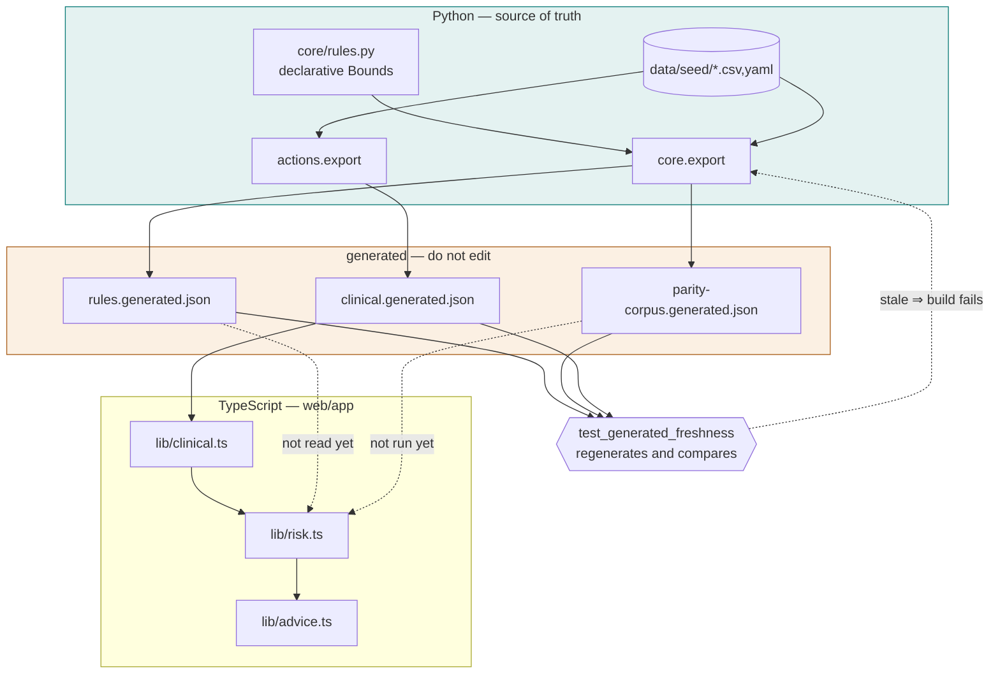
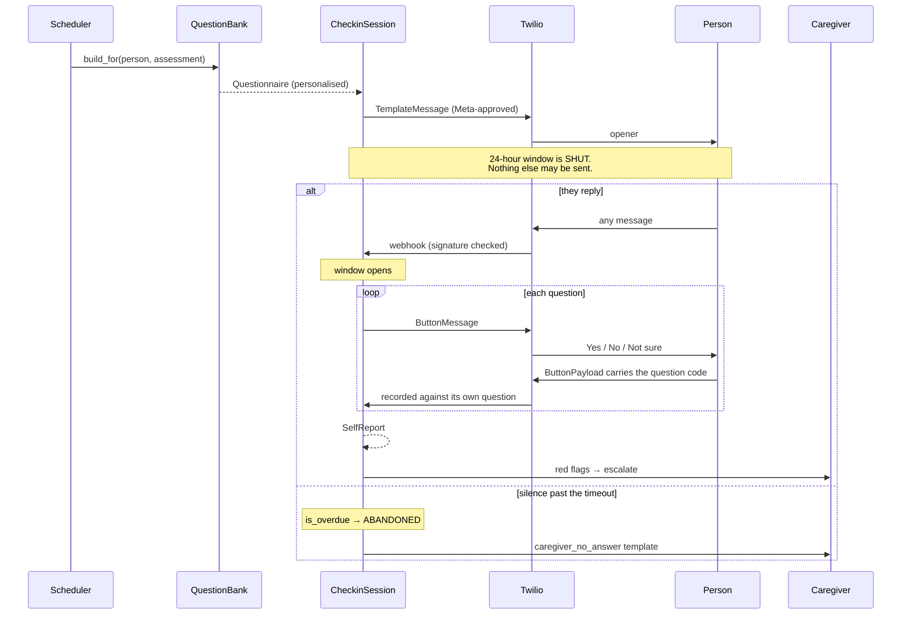
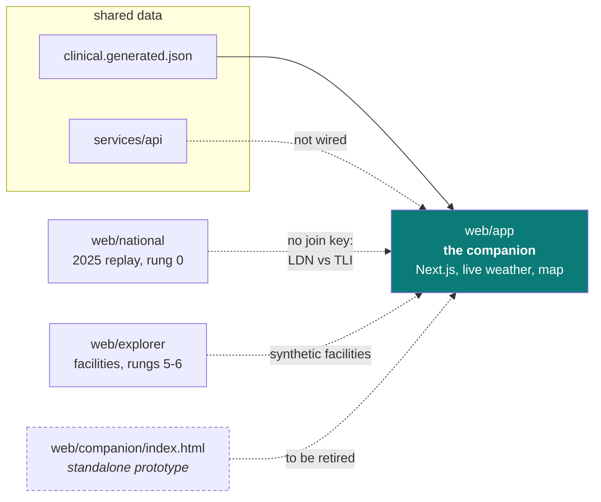
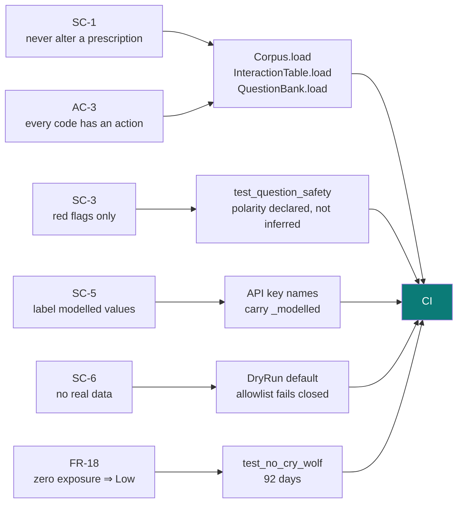

# Architecture

Drawn from the actual manifests and imports, not an intended design. Where the
diagram and the code disagree, the code is right and this file is a bug.

Diagrams render on GitHub.

---

## 1. The spine

What the system does, end to end. Every arrow is a real call; every label is the
type that crosses.

**The loop worth noticing** is `SelfReport → IndoorModel`. What the person says on
a check-in corrects the modelled indoor estimate, which is the system's dominant
error term. It is the only arrow that goes backwards, and it is the one that moved
Doris from High to Severe.

`RiskScorer` never sees a forecast, a clock, or a database. Everything reaching it
is a frozen dataclass.

---

## 2. Package dependencies

Exactly what the manifests declare. Acyclic — `contracts` at the bottom, nothing
below it.

`predictors` and `geography` depend on nothing — dashed because that is
deliberate, not an oversight. The predictor seam must not import the scoring core
(AC-1), and geography is pure data loading.

**A cycle existed here and was removed.** `core.export` imported
`actions.interactions` through a function-local import, so the manifests showed no
cycle while `core.export` could not run without `actions` installed. The clinical
export now lives in `actions.export`, where the dependency already pointed.

---

## 3. Two engines, one source of truth

The front end scores in TypeScript so it works offline (NFR-04). That is two
implementations of L3 — the thing AC-1 and AC-5 exist to prevent — and it has
already cost once.

Solid arrows are wired. **Dashed arrows are not**: the TypeScript reads the
clinical content but still carries its own rule literals and has never been run
against the parity corpus. The gate proves the files match Python; it does not yet
prove the app uses them.

---

## 4. A check-in, over time

Messaging is asynchronous, which is why this is a state machine rather than a
function call.

**The unanswered branch is not an error path.** A missed call during a risk window
is the condition the system exists to catch, so it escalates outward rather than
retrying inward.

---

## 5. Surfaces, and who owns them

The three dashed edges are the honest state of it:

- **`national` cannot join to `app`.** One says `LDN`, the other says `TLI`. There
  is no shared region identifier, so nothing can flow between them without a
  mapping table.
- **`explorer` generates its facilities from a seeded RNG**, not from
  `data/geography/*.yaml`, so it and `AllocationEngine` disagree about what exists.
- **`web/companion/index.html` is superseded** by `web/app` and is due for
  retirement rather than maintenance.

---

## 6. Where the safety constraints are enforced

Not documentation — each of these fails a build.

SC-1 is enforced at **load**, not only in tests: a corpus that advises changing a
prescription refuses to load, so the property holds for any caller — including one
that never runs the suite.
